# Sumqz-s-Split-Keyboard

## NOTE TO REVIEWER FROM BLUEPRINT: Because the projects exceeds the 100 dollar price limit of T3 projects i am willing to pay the additional 50 dollars needed. I am happy with a partial grant!

Hey everyone, this is my split keyboard project.

I always felt that traditional keyboards were functional but boring, so I decided to build my own. It can work as two separate halves or snap together with magnets to become a full 75% style keyboard in seconds.

It is hot-swappable, uses nRF52840 boards, and is designed to be easy to build at home.

I sanity-checked this design with my friend before finalizing it.

## Short Description

A DIY wireless split keyboard with magnetic attachment and hot-swap sockets.

## Pictures

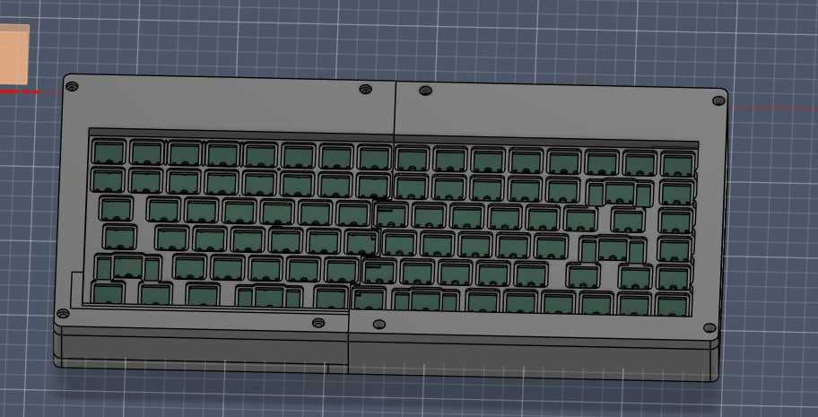
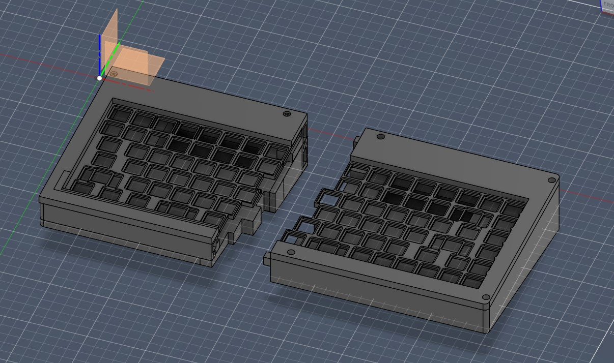
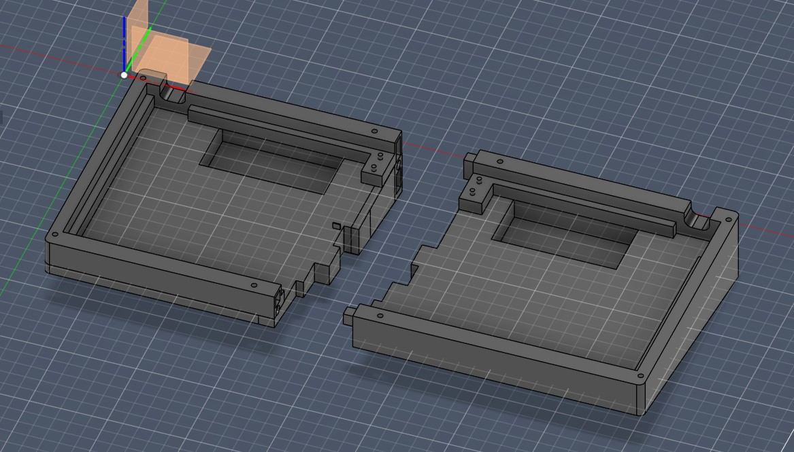
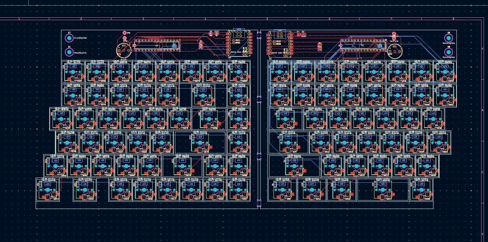
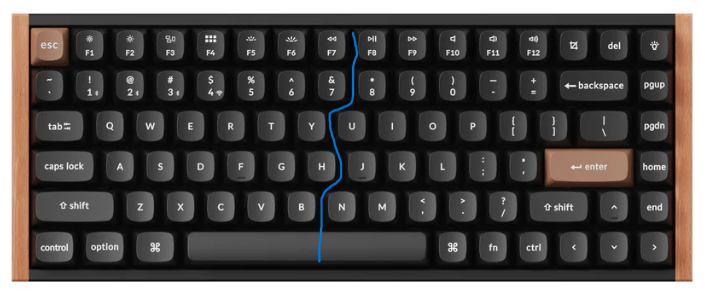
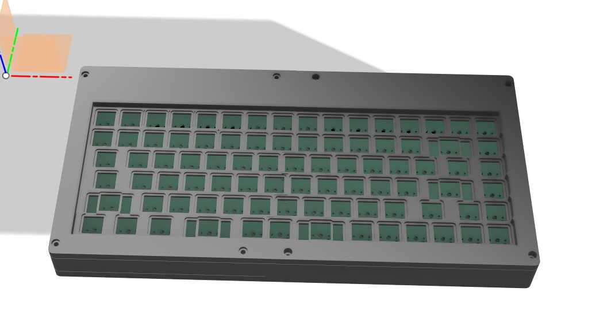
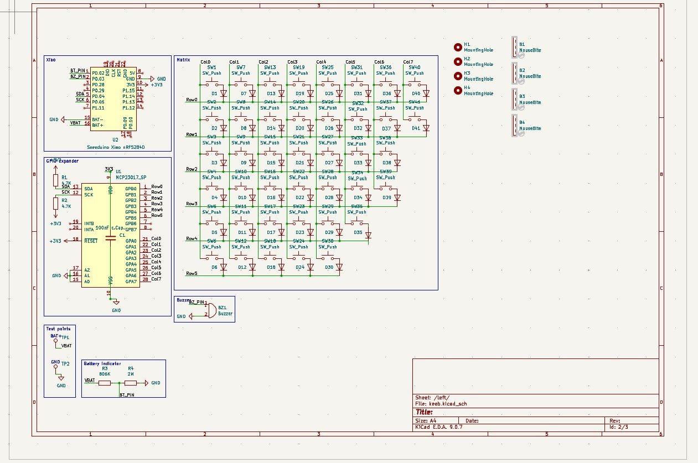
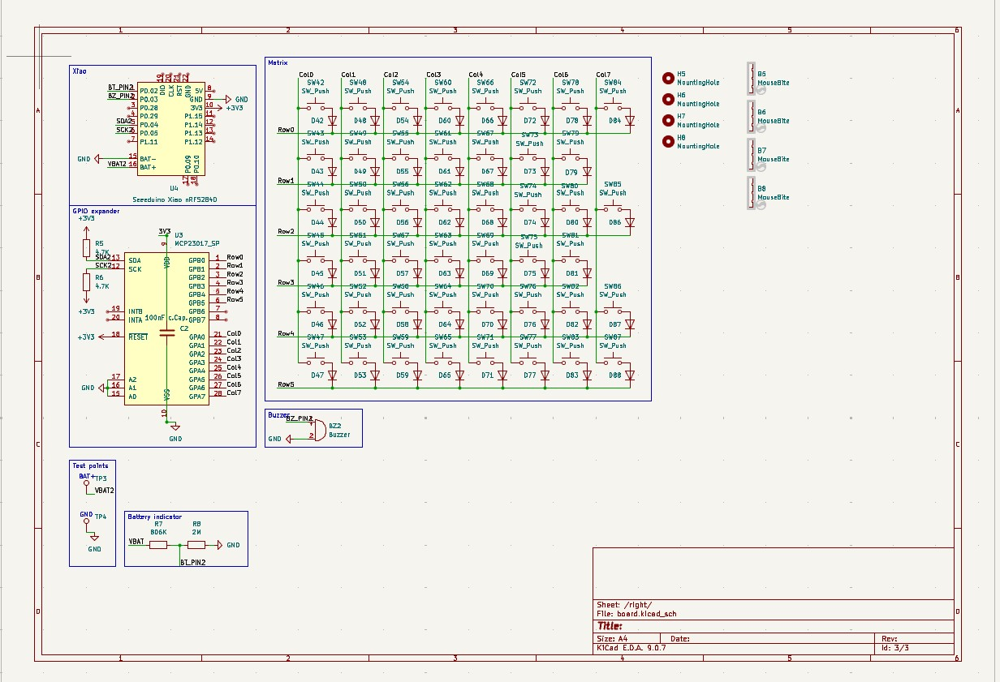
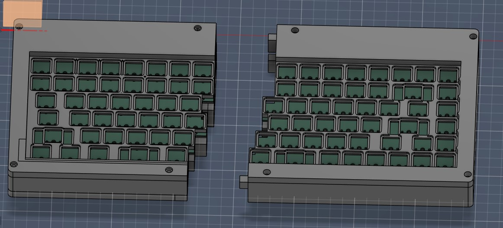
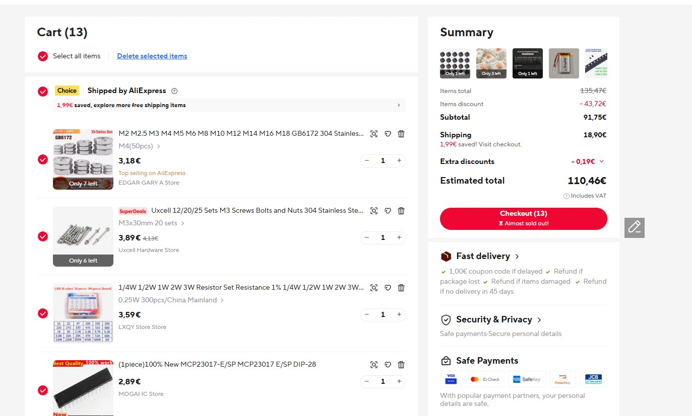
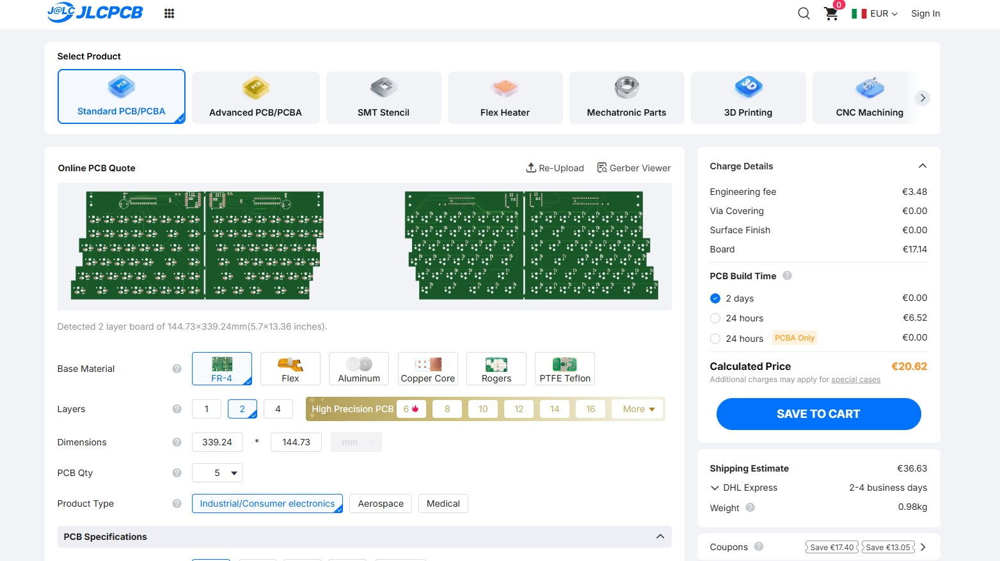

## Bill of Materials

| Part | Qty | Notes | Link |
|---|---:|---|---|
| nRF52840 (XIAO nRF52840) | 2 | One per side | [Buy](https://it.aliexpress.com/item/1005006988954136.html) |
| MCP23017 GPIO Expander | 2 | MCP23017_SP, DIP-28 package required | [Buy](https://it.aliexpress.com/item/1005009603989894.html) |
| LiPo 1200mAh | 2 | One per side | [Buy](https://it.aliexpress.com/item/1005011550469394.html) |
| Buzzer 12x9.5 / RM7.6 | 2 | Match PCB footprint pin spacing | [Buy](https://it.aliexpress.com/item/1005002576043967.html) |
| Switches (Holy Panda) | 87 | Total keys | [Buy](https://it.aliexpress.com/item/1005004388563696.html) |
| Keycaps (generic) | 87 | Match your layout | [Buy](https://it.aliexpress.com/item/1005011879391386.html) |
| Diodes 1N4148W (SOD-123) | 87 | One per switch | [Buy](https://it.aliexpress.com/item/1005003194674618.html) |
| Resistor 4.7k (0805) | 4 | R1, R2, R5, R6 | [Buy](https://it.aliexpress.com/item/1005011649990763.html) |
| Resistor 806k (0805) | 2 | R3, R7 | [Buy](https://it.aliexpress.com/item/1005011649990763.html) |
| Resistor 2M (0805) | 2 | R4, R8 | [Buy](https://it.aliexpress.com/item/1005011649990763.html) |
| Magnets 6x2 | 8 | 2 per hole | [Buy](https://it.aliexpress.com/item/1005009677185619.html) |
| M3 screw + nut | 4 | 40 mm | [Buy](https://it.aliexpress.com/item/1005008625463950.html) |
| M4 screw | 4 | 50 mm | [Buy](https://it.aliexpress.com/item/1005008625463950.html) |
| M4 nut | 4 | M4 | [Buy](https://it.aliexpress.com/item/1005010329406193.html) |
| Hotswap sockets | 87 | choc | [But](https://it.aliexpress.com/item/1005008543325730.html)

# Total price: about 130 euros or 150 dollars

PCB and case are not included because they are custom-made.

Resistor note: it is usually cheaper to buy one full 0805 resistor assortment than to buy each value separately.

## How to Use

Flash the `.ino` firmware to both nRF52840 boards. Then connect each half to your PC and test that every key works.

You can use it as a split keyboard, or snap both halves together with magnets to use it like a full 75% style board.

## Firmware

Firmware source: `Firmware/SplitKeyboard/SplitKeyboard.ino`
